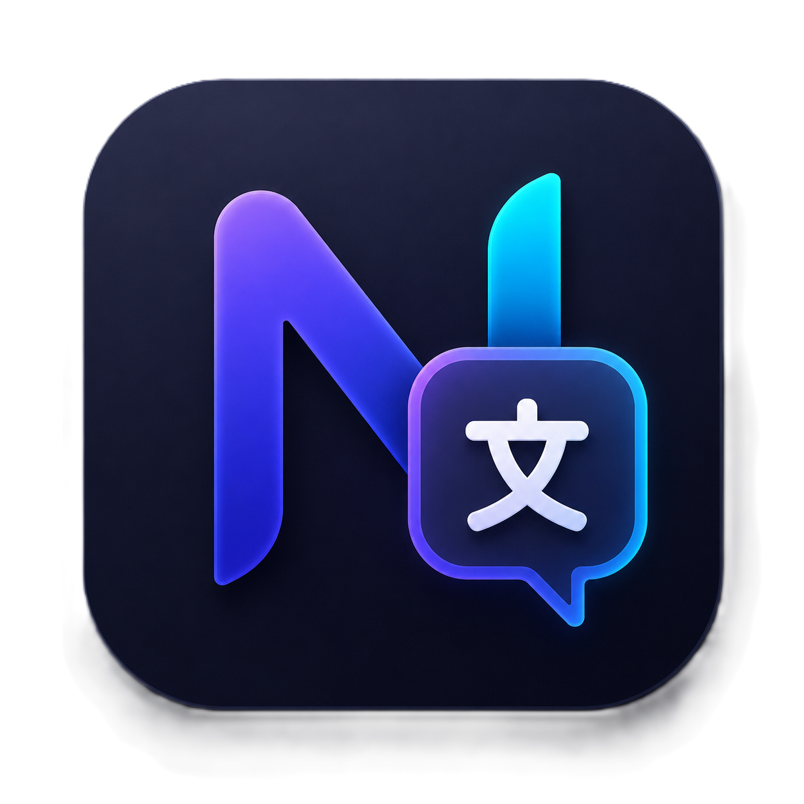

<div align="center">
  
</div>

# NexusLingua

超軽量・高速なAI翻訳・アシスタントデスクトップアプリ。
テキスト選択や画面キャプチャから瞬時にGemini APIを呼び出し、自然な翻訳・要約・解説を提供します。

## 特徴
- **テキスト選択翻訳 (デフォルト: `Alt + T`)**: 任意のアプリでテキストを選択してショートカットキーを押すだけで自動でクリップボード経由で翻訳します。
- **キャプチャ翻訳 (デフォルト: `Alt + S`)**: Windows標準のSnipping Toolを呼び出し、選択した画像内のテキストをOCR＆コンテキスト理解込みで翻訳します。マルチモニター環境にも完全対応しています。
- **Gemini API連携**: `gemini-1.5-flash` や `gemini-2.0-flash` といった超高速モデルを利用し、瞬時に結果を返します。
- **カスタマイズ機能**: ショートカットキーの自由な変更や、ウィンドウの「常に最前面表示」に対応。
- **キャッシュ機能**: 翻訳・要約・解説タブを切り替えた際の無駄なAPI通信を省き、瞬時に結果を表示（トークン節約）。
- **超軽量**: Tauri (Rust) をバックエンドに採用しており、メモリ消費量や起動時間が最小限に抑えられています。

## 技術スタック
- **Frontend**: React 19 + TypeScript + Vite
- **Backend**: Tauri v2 + Rust
- **Styling**: Vanilla CSS (Glassmorphism, Dark Mode)
- **AI**: Google Gemini API

## 開発環境のセットアップ

1. **前提条件**:
   - Node.js (v18+)
   - Rust (rustup)
   - Windows (MSVC build tools)

2. **インストール**:
   ```bash
   npm install
   ```

3. **開発サーバーの起動**:
   ```bash
   npm run tauri dev
   ```

4. **ビルド**:
   ```bash
   npm run tauri build
   ```

## ドキュメント
より詳細な仕様や使い方については `doc/` ディレクトリを参照してください。
- [技術仕様書 (specification.md)](./doc/specification.md)
- [ユーザー向けガイド (usage.md)](./doc/usage.md)
